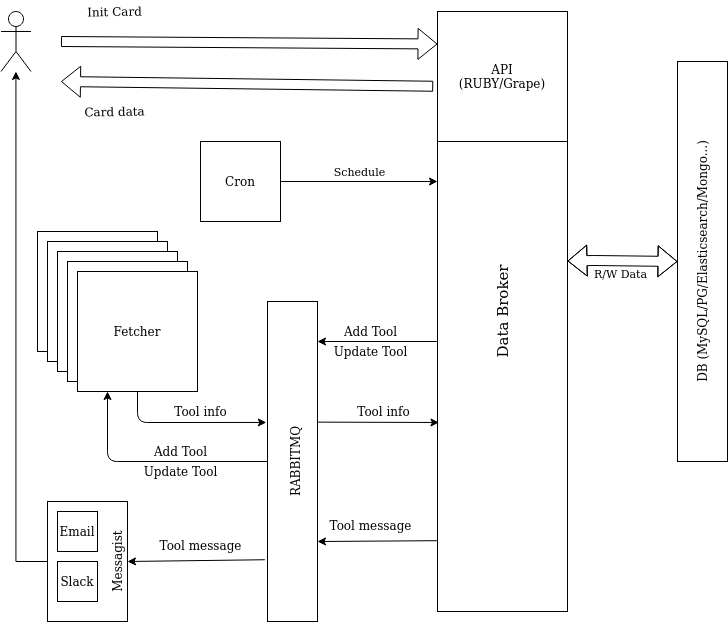

# Soft Info

Расширяемая система сбора информации о программном обеспечении.

## Состав

* **ClientAPI**: api для связи с внешним миром, позволяет добавить новое ПО (если разрешено) и получить информацию, об уже существующих хаписях
* **Fetcher**: сервис для получения данных о ПО. Источниками могут быть как общедоступные, так и приватные данные (Github, Jira, Wiki и т.д.)
* **DataBroker**: связующий элемент для всех частей системы, проксирует сообщения от _ClientAPI_ к базе данных. Следит за актуализацией данных, посредством запуска _Fetchers_
* **DB**: хранилище данные о ПО. В общем случае тип базы не принципиален, но наиболее подходящим видится MySQL

# ToDo

* Закончить Broker
* Сделать UserAPI
* Скелет Fetcher
* Fetcher для Github